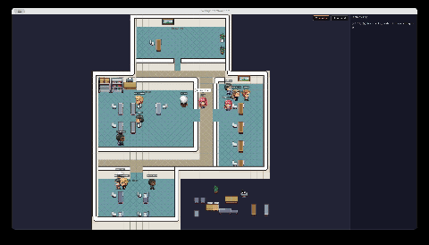
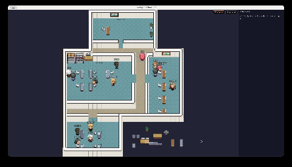

<div align="center">

# 🧠 Woosdom

**Your AI agents have a life of their own. Watch them work.**

A self-hosted multi-engine AI orchestration system with real-time pixel art visualization.\
Your data, your rules, your local vault.

<!-- GIF placeholder: 사용자가 녹화 후 교체 -->

*Brain dispatches a task → Antigravity team springs into action*


*Agents roam the office, sit at desks, and collaborate in real-time*

</div>

---

## What is Woosdom?

Woosdom is a **personal AI operating system** that runs entirely on your machine.
A Brain (Claude Opus) thinks. Hands (GPT / Gemini / Codex) execute. Obsidian remembers.
Every decision, every rule, every piece of context lives in your local vault — not someone else's cloud.

## Architecture

```
You (Decision Maker)
 └── Brain (Claude Opus 4.6) — Strategy & Orchestration
       ├── CC Team (Claude Code) — Local code execution
       ├── AG Team (Antigravity)  — Research & visual verification  
       ├── Codex Team (OpenAI)    — Cloud computation
       └── Obsidian Vault (Memory) — Persistent knowledge base
```

- **Engine Router** — Brain analyzes each task and delegates to the best-fit engine
- **3-Way Council** — Critical decisions are cross-verified by 3 independent AI engines
- **File-based IPC** — `to_hands.md` (dispatch) / `from_hands.md` (results) for async task delegation
- **Domain Rules** — Finance, career, health — each domain has its own rule file that AI must follow

## How It Compares

| | Woosdom | Perplexity Computer | Claude Code | OpenClaw |
|---|:---:|:---:|:---:|:---:|
| **Data stays local** | ✅ | ❌ Cloud | ❌ Cloud | ✅ |
| **Multi-engine orchestration** | ✅ 3+ engines | ❌ Single | ❌ Single | △ Partial |
| **Persistent memory** | ✅ Obsidian vault | ❌ | ❌ | △ |
| **Domain-specific rules** | ✅ Per-domain .md | ❌ | ❌ | ❌ |
| **Visual agent monitoring** | ✅ Pixel art office | ❌ | ❌ Terminal only | ❌ |
| **Cross-engine verification** | ✅ 3-way council | ❌ | ❌ | ❌ |
| **Cost** | Your own API keys | $20+/mo subscription | $20+/mo | Free |
| **Open source** | ✅ | ❌ | ❌ | ✅ |

## Visual Companion: pixel-agents-woosdom

See [**pixel-agents-woosdom**](./02_Projects/pixel-agents-woosdom/) — a desktop Electron app that visualizes Woosdom's AI agents as pixel art characters working in a virtual office.

- 🏢 3 team rooms (CC / AG / Codex) + Brain command center
- 📋 Brain writes `to_hands.md` → agents walk to their desks and start working
- ⌨️ Real-time status: typing animation (working), walking (idle), ✅ (done), ❌ (error)
- 🎨 Customizable office layout and agent roles

## Quick Start

### 1. Clone & set up the vault
```bash
git clone https://github.com/ahnsemble/woosdom-brain-repo.git
cd woosdom-brain-repo
# Open in Obsidian as a vault
```

### 2. Run pixel-agents (optional)
```bash
cd 02_Projects/pixel-agents-woosdom
npm install
npm run dev
```

### 3. Configure your Brain
Edit `00_System/Prompts/Ontology/brain_directive.md` to customize:
- Your domain rules (finance, career, health, etc.)
- Engine preferences (which AI handles what)
- Safety constraints

## Project Structure

```
woosdom-brain-repo/
├── 00_System/          # Brain directive, prompts, templates
├── 01_Domains/         # Domain-specific rules & data
│   ├── Finance/        # Portfolio rules, analysis protocols  
│   ├── Career/         # Roadmap, skills tracking
│   └── Health/         # Training protocols
├── 02_Projects/        # Active projects
│   ├── pixel-agents-woosdom/  # Visual companion (Electron)
│   ├── task_bridge/    # Engine router scripts
│   └── woosdom_app/    # Dashboard
├── 03_Journal/         # Daily logs
└── 04_Archive/         # Completed work
```

## Acknowledgments

- Inspired by [pablodelucca/pixel-agents](https://github.com/pablodelucca/pixel-agents) — the original VS Code extension that turns Claude Code agents into pixel art characters
- Office simulation concept influenced by [a16z-infra/ai-town](https://github.com/a16z-infra/ai-town)
- Tileset assets require separate RPG Maker VX Ace compatible tilesets (not included due to licensing)

## License

MIT © ahnsemble
